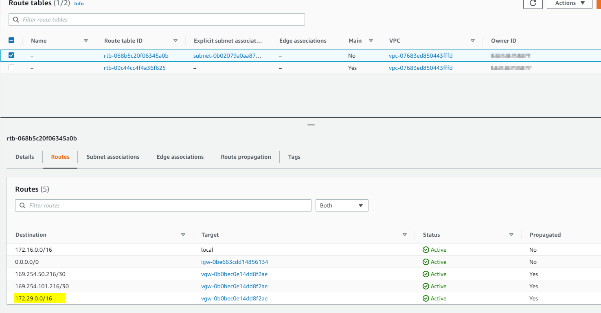
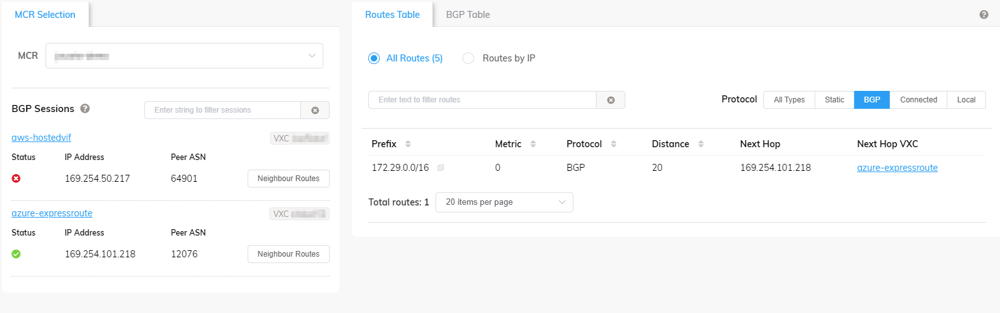
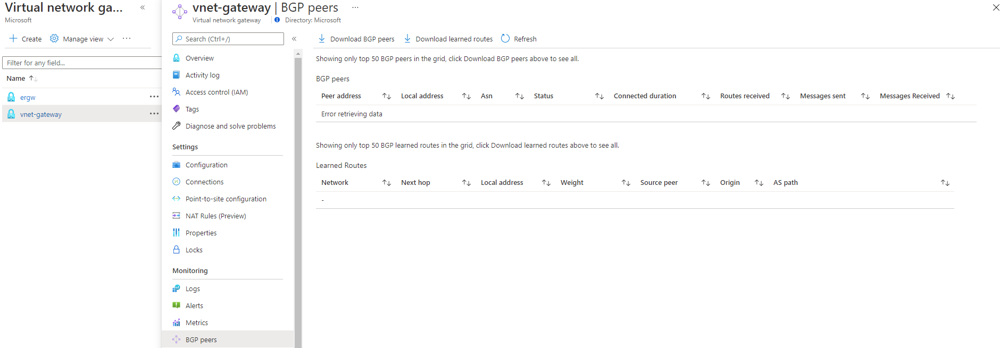

# Interconnecting Azure and AWS Using ExpressRoute/DirectConnect Through Megaport MCR and Native IPSec VPN Solutions for Redundancy

## Overview

This hands-on lab shows how redundancy between Azure ExpressRoute and Azure IPSec VPN works. It also shows how IPSec VPN between Azure and AWS using native PaaS services works and discusses some of the limitations with this approach. It doesn't go through the initial configuration and setup; the environment can be deployed using the Terraform files included in this lab.

## Prerequisites

In order to deploy this environment the following prerequisites must be met:

- A valid Azure Subscription ID
- A valid AWS Account
- A valid Megaport Account with permissions to deploy Megaport Cloud Router (MCR) and VXC to interconnect with Azure and AWS
- An RSA SSH Key-pair

## Resources Deployed

The following resources are created through the Terraform files included in this lab:

### Azure

- One /16 VNET in region US East 2 with two /24 subnets; one for the VM and one for the VNET Gateways
- One ExpressRoute Gateway of SKU Standard
- One Active/Active VPN Gateway. Generation2 and SKU VpnGw2
- One VM Size Standard D1 v2 (1 vcpus, 3.5 GiB memory)
- One ExpressRoute Circuit with peering location "Washington DC2". The circuit bandwidth is 50 Mbps and SKU Standard
- Four local network gateways

### AWS

- One /16 VPC in region us-east-1 with one /24 subnet for the EC2 instance
- One Internet Gateway
- One route table
- One network ACL allowing all traffic
- One security group allowing all traffic
- One Virtual Private Gateway
- Two Site-to-Site VPN connections
- One DirectConnect Gateway
- One hosted VIF deployed through Megaport
- One EC2 instance t2.micro running Amazon Linux AMI

### Megaport

- One MCR in Equinix DC2, Ashburn, USA
- One VXC in CoreSite VA1, Reston, USA for interconnecting with Azure
- One VXC in Equinix DC2, Ashburn, USA for interconnecting with AWS

## Deployment Instructions

1. Download all the files under directory Terraform to a local directory in your computer and edit the following three files with the information belonging to your environments:

    - `terraform.tfvars` defines the Megaport username and password in addition to other variables for which no default values have been specified. This file can also be used to specify values for other variables defined in files with suffix `_options` if the defaults don't work for you 
    - `credentials` defines the AWS access key ID and secret access key to authenticate with AWS
    - `ssh-key.pub` is the public key value of the RSA SSH Key you will use to connect to Azure VM and AWS EC2 instance

2. Log in to Azure using Azure CLI

3. From a command line interface navigate to the directory where the Terraform files were downloaded and run the following commands:

    ```bash
    terraform init
    terraform plan
    terraform apply    
    ```

> :point_right: If Megaport is configured to use MFA, MFA must first be reset and parameter `mfa_otp_key` must be added to the Terraform provider configuration block in file `megaport_artifacts.tf` as described [here](https://registry.terraform.io/providers/megaport/megaport/latest/docs/guides/gettingstarted#multi-factor-authentication-otp-key)

> :point_right: Fix any errors reported by `terraform plan` before running `terraform apply`

## Topology

The diagram below shows the deployed environment using the default values defined for the variables:


## Verifications

### Azure ExpressRoute, AWS Direct Connect and IPSec VPN are all Connected and Exchanging Routes

#### Azure ExpressRoute and AWS Direct Connect Verification

From Megaport dashboard navigate to MCR Looking Glass and verify that the BGP sessions to AWS and Azure are established and it is learning the Azure VNET and AWS VPC address spaces:


> :point_right: If you look closely you will notice that the MCR has only one BGP session with Azure, this means there is no redundancy for the Azure ExpressRoute circuit. This was a deliberate choice not because this is a lab, but because Azure ExpressRoute edge routers don't discard BGP prefixes that carry BGP ASN 12076 (Azure ExpressRoute) in their AS-PATH and MCR will advertise all prefixes received from one VXC to all other VXCs, leading to route flaps if both ports of an Azure ExpressRoute circuit are connected to the same MCR. This behavior is not exclusive to Megaport MCR, this is standard BGP behavior -routes learned from one eBGP neighbor are sent to all other eBGP and iBGP neighbors; if you connect both ports of an ExpressRoute circuit to the same router on your end you need to make sure to implement filtering as to not cross-advertise routes from ASN 12076 between ExpressRoute circuit ports

From AWS portal navigate to "Direct Connect" located under "Networking & Content Delivery" and verify the state and BGP status of the Virtual Interface:


From AWS portal verify the Direct Connect gateway is associated with the Virtual Interface:


From AWS portal verify the Direct Connect gateway is associated with the Virtual Private gateway attached to the VPC:


From AWS portal inspect the routes in the route table associated with the subnet and verify the Azure VNET CIDR is showing:



Using Azure CLI, list the route tables learned by the ExpressRoute circuit and verify both Azure VNET and AWS VPC address spaces are being learned with the proper AS-PATH. Note the ExpressRoute circuit represents the Azure ExpressRoute Edge Routers (ASN 12076):

```bash
# Primary Port:

jumpbox$ az network express-route list-route-tables --path primary --peering-name AzurePrivatePeering --ids /subscriptions/<SUBSCRIPTION GUID>/resourceGroups/vpn-rg/providers/Microsoft.Network/expressRouteCircuits/to-megaport --query "value" -o table
This command is in preview and under development. Reference and support levels: https://aka.ms/CLI_refstatus
Network            NextHop          LocPrf    Weight    Path
-----------------  ---------------  --------  --------  -----------
169.254.50.216/30  169.254.101.217            0         64600 ?
172.16.0.0         169.254.101.217            0         64600 64901
172.29.0.0         172.29.255.12              0         65515
172.29.0.0         172.29.255.13*             0         65515

# Secondary Port:

jumpbox$ az network express-route list-route-tables --path secondary --peering-name AzurePrivatePeering --ids /subscriptions/<SUBSCRIPTION GUID>/resourceGroups/vpn-rg/providers/Microsoft.Netwo
rk/expressRouteCircuits/to-megaport --query "value" -o table
This command is in preview and under development. Reference and support levels: https://aka.ms/CLI_refstatus
Network     NextHop         LocPrf    Weight    Path
----------  --------------  --------  --------  ------
172.29.0.0  172.29.255.13             0         65515
172.29.0.0  172.29.255.12*            0         65515
```

> :point_right: As expected, only the primary port is learning the routes from AWS (ASN 64900); however the secondary port still learns the Azure VNET address space from the ExpressRoute gateway. This demonstrates that an ExpressRoute circuit is highly available all the way to the edge, it is the customer responsibility to connect to both ExpressRoute ports, preferably from different devices, to achieve end to end high availability and be eligible for the [ExpressRoute SLA](https://azure.microsoft.com/en-us/support/legal/sla/expressroute/v1_3/)

Using Azure CLI, list the BGP neighbors of Azure ExpressRoute Gateway and verify it is connected to the ExpressRoute circuit (ASN 12076):

```bash
jumpbox$ az network vnet-gateway list-bgp-peer-status --ids /subscriptions/<SUBSCRIPTION GUID>/resourceGroups/vpn-rg/providers/Microsoft.Network/virtualNetworkGateways/ergw -o table

Neighbor       ASN    State      ConnectedDuration    RoutesReceived    MessagesSent    MessagesReceived
-------------  -----  ---------  -------------------  ----------------  --------------  ------------------
172.29.255.4   12076  Connected  17:54:06.7422782     3                 1232            1194
172.29.255.5   12076  Connected  17:53:56.3360212     0                 1233            1187
172.29.255.14  65515  Connected  17:46:41.9584986     1                 1241            1223
172.29.255.15  65515  Connected  17:46:21.9738131     1                 1239            1230
```

> :point_right: Notice there are two neighbors in ASN 65515, this is the default ASN used by Azure VPN Gateway and cannot be changed when both ExpressRoute and VPN Gateways are deployed in the same VNET as described in the official Azure documentation [here](https://docs.microsoft.com/azure/expressroute/expressroute-howto-coexist-resource-manager#limits-and-limitations). This is because all gateways, including Azure Route Server, deployed in a VNET are required to establish an iBGP full mesh. This is because whenever ExpressRoute gateway is deployed in the VNET, regardless of whether it is connected to an ExpressRoute circuit or not, it is responsible to program all routes learned across all gateways in the VNET (this includes ExpressRoute Gateways, VPN Gateways and Azure Route Server) into the Azure fabric. Care must be taken when associating route tables with the GatewaySubnet; as a best practice always add a route pointing to the GatewaySubnet address space, and RouteServerSubnet if present, with next-hop type "VirtualNetwork" to route tables associated with the GatewaySubnet, otherwise the iBGP sessions might break, causing the removal of all routes learned by Azure VPN Gateway and Azure Route Server from Azure fabric, which most likely will result in an outage.

Using Azure CLI, list the routes learned by Azure ExpressRoute Gateway and verify it is learning the AWS VPC address space:

```bash
jumpbox$ az network vnet-gateway list-learned-routes --ids /subscriptions/<SUBSCRIPTION GUID>/resourceGroups/vpn-rg/providers/Microsoft.Network/virtualNetworkGateways/ergw -o table

Network             Origin    SourcePeer     AsPath             Weight    NextHop
------------------  --------  -------------  -----------------  --------  -------------
172.29.0.0/16       Network   172.29.255.13                     32768
169.254.101.216/30  EBgp      172.29.255.4   12076-64600        32769     172.29.255.4
169.254.50.216/30   EBgp      172.29.255.4   12076-64600        32769     172.29.255.4
172.16.0.0/16       EBgp      172.29.255.4   12076-64600-64901  32769     172.29.255.4
172.16.0.0/16       IBgp      172.29.255.14  64900              32768     172.29.255.14
172.16.0.0/16       IBgp      172.29.255.15  64900              32768     172.29.255.15
```

> :point_right: Notice there are three entries for `172.16.0.0/16`, the first entry is being learned from the ExpressRoute circuit, we can tell by looking at the Origin (EBgp) and AsPath (12076) columns. The last two entries are being learned from the VPN Gateway instances and their Origin is IBgp. Although the VPN Gateway learned routes have a shorter AS-PATH than the ExpressRoute circuit learned route, ExpressRoute learned routes are preferred over any other gateway learned routes -including Azure Route Server- with the same prefix length because they are programmed with the largest Weight (32769 vs 32768). Note this Weight attribute is different from the ExpressRoute connection weight attribute and cannot be changed. The only way to prefer IPSec VPN, or Azure Route Server, over ExpressRoute is to advertise more specific prefixes.

#### IPSec VPN Verification

> :point_right: If you are looking for step by step instructions on how to deploy IPSec VPN between Azure VPN Gateway and AWS Virtual Private Gateway, checkout the excellent article written by my colleague and friend Adilson Coutrin [here](https://github.com/adicout/lab/tree/master/Network/aws-vpn-to-azurevpngw-ikev2-bgp)

From AWS portal inspect each of the Site-to-Site VPN connections that were created:

AWS Site-to-Site VPN Connection 1 to Azure VPN Gateway Instance 0:


AWS Site-to-Site VPN Connection 2 to Azure VPN Gateway Instance 1:


> :point_right: Notice that only `Tunnel 1` in each connection is `UP`; however if we take a closer look at `Tunnel 2` in both connections we can see `IPSEC IS UP`, this means both VPN Phase I and II were successfully established -which can further be confirmed by looking at the connection status under Azure VPN Gateway- but BGP could not be established over `Tunnel 2`, this is because each instance of Azure VPN Gateway in Active/Active mode can only have one APIPA BGP speaker. This implies that in order to have redundancy when running BGP over IPSec between AWS and Azure VPN Gateway in Active/Active mode one AWS VPN connection to each Azure VPN Gateway instance is needed because Azure doesn't float the BGP speaker between instances if an instance fails.

Azure VPN Gateway Connection Status:


From Azure portal inspect the BGP neighbors of Azure VPN Gateway and verify the BGP sessions to AWS are "Connected":


> :point_right: Notice how each VPN Gateway instance has a single BGP neighbor in "Connected" status with ASN 64900 (AWS Virtual Private Gateway ASN). The local address is always the VNET address of the instance. Azure VPN gateway doesn't initiate BGP sessions from the APIPA address, it only listens for them. When using APIPA addresses it is important to make sure the peer will initiate the BGP session, otherwise BGP will never establish. Additionally, Azure will always attempt to initiate BGP sessions using the VNET address as the BGP speaker, even when APIPA addresses are configured.

From Azure portal inspect the BGP learned routes in Azure VPN Gateway. Verify it is learning AWS VPC address space `172.16.0.0/16` from AWS APIPA BGP speakers


> :point_right: Notice each VPN Gateway instance also learns the VPC address space from the peer instance via iBGP.

#### Endpoint Verification

From Azure CLI, inspect the effective route table for the VM NIC deployed in the VNET, verify AWS VPC address space `172.16.0.0/16` has been programmed in Azure fabric and the "Next Hop IP" points to ExpressRoute:

```bash
jumpbox$ az network nic show-effective-route-table --ids /subscriptions/<SUBSCRIPTION GUID>/resourceGroups/vpn-rg/providers/Microsoft.Network/networkInterfaces/vm-nic -o table | grep -E 'Source|Gateway|--'

Source                 State    Address Prefix    Next Hop Type          Next Hop IP
---------------------  -------  ----------------  ---------------------  -------------
VirtualNetworkGateway  Active   172.16.0.0/16     VirtualNetworkGateway  10.3.129.92
```

> :point_right: With ExpressRoute, "Next Hop IP" field is tricky because it is an IP address assigned by Microsoft to the ExpressRoute edge router. Even if this address overlaps with any other networks, on premises or in the cloud, there are no risks associated with it because it belongs to the underlay network and doesn't interact with the user infrastructure

> :point_right: If both ports of the ExpressRoute circuit were connected there would be two entries for `172.16.0.0/16`. Azure fabric performs equal cost multi-path (ECMP) for up to 8 paths for the same prefix.

Trace the network path between the Azure VM and AWS EC2 instance and verify traffic is flowing through Megaport MCR:

```bash
# Azure VM

AzureAdmin@vpn-vm:~$ traceroute 172.16.0.10
traceroute to 172.16.0.10 (172.16.0.10), 64 hops max
  1   172.29.255.4  6.244ms  5.672ms  5.737ms
  2   169.254.101.217  6.765ms  6.053ms  6.151ms
  3   169.254.50.217  7.693ms  6.438ms  6.286ms
  4   172.16.0.10  6.998ms  6.843ms  6.978ms

# AWS EC2 Instance

[ec2-user@ip-172-16-0-10 ~]$ traceroute 172.29.0.10
traceroute to 172.29.0.10 (172.29.0.10), 30 hops max, 60 byte packets
 1  169.254.255.49 (169.254.255.49)  0.617 ms  0.459 ms  0.589 ms
 2  169.254.50.217 (169.254.50.217)  0.953 ms  2.084 ms  1.059 ms
 3  169.254.50.218 (169.254.50.218)  1.110 ms  1.073 ms  1.117 ms
 4  169.254.101.218 (169.254.101.218)  1.669 ms  1.689 ms  1.704 ms
 5  * * *
 6  172.29.0.10 (172.29.0.10)  8.114 ms  7.831 ms  7.174 ms
```

### Failover from ExpressRoute/Direct Connect to IPSec VPN

Run hping3 with the --fast option to send 10 packets per second between Azure VM and AWS EC2 instance and while it is running, shutdown either VXC at Megaport MCR to simulate a circuit failure:


```bash
# Azure VM
# Output truncated

AzureAdmin@vpn-vm:~$ sudo hping3 172.16.0.10 -S -p 22 --fast
HPING 172.16.0.10 (eth0 172.16.0.10): S set, 40 headers + 0 data bytes
len=44 ip=172.16.0.10 ttl=245 DF id=0 sport=22 flags=SA seq=187 win=26883 rtt=8.4 ms
len=44 ip=172.16.0.10 ttl=245 DF id=0 sport=22 flags=SA seq=188 win=26883 rtt=12.2 ms
len=44 ip=172.16.0.10 ttl=245 DF id=0 sport=22 flags=SA seq=189 win=26883 rtt=8.2 ms
ICMP Host Unreachable from ip=172.29.255.4 name=UNKNOWN
ICMP Host Unreachable from ip=172.29.255.4 name=UNKNOWN
ICMP Host Unreachable from ip=172.29.255.4 name=UNKNOWN
ICMP Host Unreachable from ip=172.29.255.4 name=UNKNOWN
ICMP Host Unreachable from ip=172.29.255.4 name=UNKNOWN
ICMP Host Unreachable from ip=172.29.255.4 name=UNKNOWN
ICMP Host Unreachable from ip=172.29.255.4 name=UNKNOWN
len=44 ip=172.16.0.10 ttl=254 DF id=0 sport=22 flags=SA seq=334 win=26883 rtt=1037.3 ms
len=44 ip=172.16.0.10 ttl=254 DF id=0 sport=22 flags=SA seq=314 win=26883 rtt=3039.2 ms
len=44 ip=172.16.0.10 ttl=254 DF id=0 sport=22 flags=SA seq=345 win=26883 rtt=16.4 ms
^C
--- 172.16.0.10 hping statistic ---
359 packets transmitted, 218 packets received, 40% packet loss
round-trip min/avg/max = 7.2/161.0/7166.3 ms


# AWS EC2 Instance
# Output truncated

[ec2-user@ip-172-16-0-10 ~]$ sudo hping3 172.29.0.10 -S -p 22 --fast
HPING 172.29.0.10 (eth0 172.29.0.10): S set, 40 headers + 0 data bytes
len=44 ip=172.29.0.10 ttl=61 DF id=0 sport=22 flags=SA seq=182 win=64240 rtt=7.5 ms
len=44 ip=172.29.0.10 ttl=61 DF id=0 sport=22 flags=SA seq=183 win=64240 rtt=7.7 ms
len=44 ip=172.29.0.10 ttl=61 DF id=0 sport=22 flags=SA seq=184 win=64240 rtt=7.3 ms
ICMP Network Unreachable from ip=169.254.50.217 name=UNKNOWN
ICMP Network Unreachable from ip=169.254.50.217 name=UNKNOWN
ICMP Network Unreachable from ip=169.254.50.217 name=UNKNOWN
ICMP Network Unreachable from ip=169.254.50.217 name=UNKNOWN
len=44 ip=172.29.0.10 ttl=64 DF id=0 sport=22 flags=SA seq=340 win=64240 rtt=8.2 ms
len=44 ip=172.29.0.10 ttl=64 DF id=0 sport=22 flags=SA seq=341 win=64240 rtt=8.2 ms
len=44 ip=172.29.0.10 ttl=64 DF id=0 sport=22 flags=SA seq=342 win=64240 rtt=7.8 ms
^C
--- 172.29.0.10 hping statistic ---
400 packets transmitted, 378 packets received, 6% packet loss
round-trip min/avg/max = 6.9/7.6/19.8 ms
```

By looking at the hping statistics above we can see it took Azure roughly 14.1 seconds (141 packets were lost) to failover while it took AWS roughly 2.2 seconds (22 packets were lost).

> :point_right: This failover time is for the purposes of this lab only and shouldn't be used as a ballpark number when designing failover for production networks. Keep in mind Azure ExpressRoute relies on the default BGP timers (60 seconds keepalive timer and 180 seconds hold timer). [BFD](https://docs.microsoft.com/azure/expressroute/expressroute-bfd) can be used to speed up convergence, but from personal experience working with multiple customers over the past couple of years, it takes about 90 seconds to failover from ExpressRoute to IPSec VPN when BFD is enabled

> :point_right: Pay close attention to the TTL value; notice how it increases when traffic switches over from Azure ExpressRoute/AWS DirectConnect to VPN. This is because there is only one hop across a tunnel. Additionally, it appears AWS Virtual Private Gateway doesn't decrement TTL unlike Azure VPN Gateway

### ExpressRoute and Direct Connect are Down, IPSec VPN is Up

Keeping the VXC shutdown on the MCR, let's look again at our data points and see what has changed.

#### Azure ExpressRoute and AWS Direct Connect Verification - MCR AWS VXC Shutdown

As expected, MCR is no longer learning the AWS VPC address space and is marking AWS VXC as down:



AWS virtual interface shows BGP status is down:


Looking at the route table associated with the VPC subnet, we can see there were no changes to the route pointing to Azure VNET address space `172.29.0.0/16`, this is because unlike Azure, AWS uses the same Virtual Private Gateway for both Direct Connect and IPSec VPN, however we can see that the /30 routes between Azure ExpressRoute and MCR, and AWS Direct Connect and MCR, are no longer in the route table:


Looking at the ExpressRoute route table we can see the route for AWS VPC address space `172.16.0.0/16` has been removed:

```bash
# Primary Port:

jumpbox$ az network express-route list-route-tables --path primary --peering-name AzurePrivatePeering --ids /subscriptions/<SUBSCRIPTION GUID>/resourceGroups/vpn-rg/providers/Microsoft.Network
/expressRouteCircuits/to-megaport --query "value" -o table
This command is in preview and under development. Reference and support levels: https://aka.ms/CLI_refstatus
Network            NextHop          LocPrf    Weight    Path
-----------------  ---------------  --------  --------  -------
169.254.50.216/30  169.254.101.217            0         64600 ?
172.29.0.0         172.29.255.12              0         65515
172.29.0.0         172.29.255.13*             0         65515

# Secondary Port:

jumpbox$ az network express-route list-route-tables --path secondary --peering-name AzurePrivatePeering --ids /subscriptions/<SUBSCRIPTION GUID>/resourceGroups/vpn-rg/providers/Microsoft.Netwo
rk/expressRouteCircuits/to-megaport --query "value" -o table
This command is in preview and under development. Reference and support levels: https://aka.ms/CLI_refstatus
Network     NextHop         LocPrf    Weight    Path
----------  --------------  --------  --------  ------
172.29.0.0  172.29.255.13             0         65515
172.29.0.0  172.29.255.12*            0         65515
```

Looking at the ExpressRoute Gateway route table we can see the routes pointing to AWS VPC address space `172.16.0.0/16` learned from the VPN Gateway instances through iBGP, but the route learned from the ExpressRoute circuit through eBGP has been removed:

```bash
jumpbox$ az network vnet-gateway list-learned-routes --ids /subscriptions/<SUBSCRIPTION GUID>/resourceGroups/vpn-rg/providers/Microsoft.Network/virtualNetworkGateways/ergw -o table
Network             Origin    SourcePeer     AsPath       Weight    NextHop
------------------  --------  -------------  -----------  --------  -------------
172.29.0.0/16       Network   172.29.255.13               32768
169.254.101.216/30  EBgp      172.29.255.4   12076-64600  32769     172.29.255.4
169.254.50.216/30   EBgp      172.29.255.4   12076-64600  32769     172.29.255.4
172.16.0.0/16       IBgp      172.29.255.14  64900        32768     172.29.255.14
172.16.0.0/16       IBgp      172.29.255.15  64900        32768     172.29.255.15
```

#### Endpoint Verification - MCR AWS VXC Shutdown

Looking at the effective route table for the VM NIC deployed in the VNET we now have two routes for AWS VPC address space `172.16.0.0/16`, one for each VPN Gateway instance. This is because Azure fabric performs equal cost multi-path (ECMP) across both instances when the VPN Gateway is in Active/Active mode. Had the VPN Gateway been deployed in the default Active/Standby mode, only one route would have been programmed. For more information about VPN Gateway redundancy refer to the official Azure documentation [here](https://docs.microsoft.com/azure/vpn-gateway/vpn-gateway-highlyavailable).

```bash
jumpbox$ az network nic show-effective-route-table --ids /subscriptions/<SUBSCRIPTION GUID>/resourceGroups/vpn-rg/providers/Microsoft.Network/networkInterfaces/vm-nic -o table | grep -E 'Source|Gateway|--'

Source                 State    Address Prefix    Next Hop Type          Next Hop IP
---------------------  -------  ----------------  ---------------------  -------------
VirtualNetworkGateway  Active   172.16.0.0/16     VirtualNetworkGateway  172.29.255.14
VirtualNetworkGateway  Active   172.16.0.0/16     VirtualNetworkGateway  172.29.255.15
```

Trace the network path between the Azure VM and AWS EC2 instance and verify traffic is flowing through the IPSec tunnel:

```bash
# Azure VM

AzureAdmin@vpn-vm:~$ traceroute 172.16.0.10
traceroute to 172.16.0.10 (172.16.0.10), 64 hops max
  1   172.16.0.10  8.108ms  7.548ms  9.369ms

# AWS EC2 Instance

[ec2-user@ip-172-16-0-10 ~]$ traceroute 172.29.0.10
traceroute to 172.29.0.10 (172.29.0.10), 30 hops max, 60 byte packets
 1  169.254.255.53 (169.254.255.53)  1.384 ms 169.254.255.49 (169.254.255.49)  0.457 ms  0.454 ms
 2  * 172.29.0.10 (172.29.0.10)  10.781 ms  10.759 ms

[ec2-user@ip-172-16-0-10 ~]$ traceroute 172.29.0.10
traceroute to 172.29.0.10 (172.29.0.10), 30 hops max, 60 byte packets
 1  169.254.255.49 (169.254.255.49)  0.406 ms  0.369 ms 169.254.255.53 (169.254.255.53)  0.359 ms
 2  * 172.29.0.10 (172.29.0.10)  10.344 ms  10.401 ms
```

> :point_right: Pay close attention to the traceroute outputs from AWS EC2 instance; notice how the first hop is different for each output. This is because when AWS learns the same address prefix over multiple VPN tunnels it will perform equal cost multi-path (ECMP) for prefixes with the same AS PATH length as long as the first AS in the AS_SEQUENCE is the same and multi-exit discriminator (MED) values are the same. To learn more about how AWS prioritizes routes refer to AWS official documentation [here](https://docs.aws.amazon.com/vpn/latest/s2svpn/VPNRoutingTypes.html)

> :point_right: As previously mentioned, Azure also performs equal cost multi-path (ECMP); however the VPN Gateway won't show up in the traceroute output. Unlike AWS, Azure neither requires that the first AS in the AS_SEQUENCE be the same nor it compares MED values; it only looks at the AS PATH length

## IPSec VPN Limitations Between Azure and AWS

I observed the following limitations while testing IPSec VPN between Azure and AWS. Note these are purely observational and I am no expert at AWS, so if I am saying something wrong here, please let me know and I will update this article.

1. **GCM ciphers cannot be used** - I first tried setting up the VPN using GCM ciphers because, according to Azure documentation ([ref](https://docs.microsoft.com/azure/vpn-gateway/vpn-gateway-about-vpn-gateway-settings#benchmark)) and my own personal testing, they offer the best throughput. Although the tunnel was successfully established and traffic was sent through it, once IPSec SA lifetime (Phase II) expired the tunnel went down and stayed down. After some investigation I came to the conclusion this happens because AWS requires Perfect Forward Secrecy (PFS) to be enabled for Phase 2 ([ref](https://aws.amazon.com/premiumsupport/knowledge-center/vpn-fix-ikev2-tunnel-instability-rekey/)), but Azure VPN Gateway doesn't support PFS when using GCM ciphers ([ref](https://docs.microsoft.com/azure/vpn-gateway/vpn-gateway-about-vpn-devices#routebased-vpn-ipsec-security-association-ike-quick-mode-sa-offers)), hence the rekey fails

2. **If using BGP, only two IPSec tunnels can be established** - Azure VPN Gateway exposes up to two VPN endpoints (public IP addresses) if using Active/Active mode, and each endpoint can only have one BGP APIPA speaker; however unlike AWS, it doesn't require that the remote BGP speaker be in the same /30 subnet. On the other hand, AWS exposes two VPN endpoints (public IP addresses) per site-to-site VPN connection, with each connection supporting one BGP APIPA speaker and each Virtual Private Gateway supports up to 10 site-to-site VPN connections ([ref](https://docs.aws.amazon.com/vpn/latest/s2svpn/vpn-limits.html)), however each BGP speaker must belong to a unique /30 subnet, hence only two IPSec tunnels that leverage BGP can be established between both providers. This is not a problem if using static tunnels. One option to workaround this limitation would be to use [Azure virtual WAN](https://docs.microsoft.com/azure/virtual-wan/virtual-wan-about), which now supports multiple virtual hubs in the same region, to have two tunnels with BGP running between Azure and AWS per virtual hub/site-to-site VPN connection pair

3. **If using BGP, up to ~1.3Gbps of total throughput can be achieved** - From my testing, up to ~650Mbps per tunnel throughput can be achieved with Azure VPN Gateway when using CBC ciphers, regardless of SKU or generation; because GCM ciphers cannot be used as described in (1) above and only two IPSec tunnels running BGP can be established as described in (2) above, this means if using BGP the max throughput achieved would be 2x ~650Mbps ~1.3Gbps.

> :point_right: I personally ran an iPerf3 test using an Azure VM size Standard D8a_v4 (8 vcpus, 32 GiB memory) with accelerated networking enabled, which according to the [documentation](https://docs.microsoft.com/azure/virtual-machines/dav4-dasv4-series#dav4-series) supports up to 8Gbps and an AWS EC2 instance size m5.16xlarge which according to the [documentation](https://docs.aws.amazon.com/AWSEC2/latest/UserGuide/general-purpose-instances.html) supports up to 20Gbps and achieved around 1.3Gbps as expected. Following is the excerpt from the iPerf3:

```bash
AzureAdmin@throughput-test-vm:~$ sudo iperf3 -c 172.16.0.100 -P 64 -t 300
[SUM]   0.00-300.00 sec  44.6 GBytes  1.28 Gbits/sec  314499             sender
[SUM]   0.00-300.00 sec  44.5 GBytes  1.28 Gbits/sec                  receiver
```

## Bonus Exercise - Breaking iBGP Between Azure Gateways

Previously I mentioned that if there is a route table associated with the GatewaySubnet and that route table has an entry for the VNET address space pointing to an NVA, if the NVA blocks BGP the iBGP session between ExpressRoute and VPN gateways will break and routes learned over VPN, or through Azure Route Server, will be withdrawn from Azure fabric, resulting in an outage. This bonus exercise deploys another VM with `IP Forwarding` enabled in the NIC, it also deploys a route table with a route for the VNET address space `172.29.0.0/16` pointing to the newly created VM and associates it with the GatewaySubnet. In order to deploy these additional artifacts move file "bonus_lab.tf" in this repository to the same local folder where you downloaded the other Terraform files, then run `terraform plan` followed by `terraform apply`.

> :point_right: Make sure you keep the BGP session on Megaport VXC shutdown to make sure AWS VPC address space `172.16.0.0/16` is only being learned through IPSec VPN.

Once the deployment completes inspect the route table that was created:


Log into NVA-VM and verify BGP traffic between the gateways is going through the VM

```bash
AzureAdmin@nva-vm:~$ sudo tcpdump -ni any port 179
tcpdump: verbose output suppressed, use -v or -vv for full protocol decode
listening on any, link-type LINUX_SLL (Linux cooked), capture size 262144 bytes
20:03:41.025093 IP 172.29.255.12.179 > 172.29.255.15.50544: Flags [P.], seq 4219910679:4219910698, ack 1753277900, win 8197, length 19: BGP
20:03:41.025132 IP 172.29.255.12.179 > 172.29.255.15.50544: Flags [P.], seq 0:19, ack 1, win 8197, length 19: BGP
20:03:41.039630 IP 172.29.255.15.50544 > 172.29.255.12.179: Flags [.], ack 19, win 16395, length 0
20:03:41.039663 IP 172.29.255.15.50544 > 172.29.255.12.179: Flags [.], ack 19, win 16395, length 0
20:03:46.606911 IP 172.29.255.15.50543 > 172.29.255.14.179: Flags [P.], seq 4004880615:4004880634, ack 2232617908, win 2048, length 19: BGP
20:03:46.606975 IP 172.29.255.15.50543 > 172.29.255.14.179: Flags [P.], seq 0:19, ack 1, win 2048, length 19: BGP
20:03:46.625913 IP 172.29.255.14.179 > 172.29.255.15.50543: Flags [.], ack 19, win 16395, length 0
20:03:46.625938 IP 172.29.255.14.179 > 172.29.255.15.50543: Flags [.], ack 19, win 16395, length 0
20:03:47.274171 IP 172.29.255.12.51019 > 172.29.255.14.179: Flags [P.], seq 2680369991:2680370010, ack 3547826368, win 1023, length 19: BGP
20:03:47.274210 IP 172.29.255.12.51019 > 172.29.255.14.179: Flags [P.], seq 0:19, ack 1, win 1023, length 19: BGP
20:03:47.292912 IP 172.29.255.14.179 > 172.29.255.12.51019: Flags [.], ack 19, win 16396, length 0
20:03:47.292992 IP 172.29.255.14.179 > 172.29.255.12.51019: Flags [.], ack 19, win 16396, length 0
^C
12 packets captured
12 packets received by filter
0 packets dropped by kernel
```

Using Azure CLI, inspect the effective routes for the NIC of the VM we had currently deployed and verify it is learning route `172.16.0.0/16` from both VPN Gateway instances:

```bash
jumpbox$ az network nic show-effective-route-table --ids /subscriptions/<SUBSCRIPTION GUID>/resourceGroups/vpn-rg/providers/Microsoft.Network/networkInterfaces/vm-nic -o table | grep -E 'Source|Gateway|--'
Source                 State    Address Prefix    Next Hop Type          Next Hop IP
---------------------  -------  ----------------  ---------------------  -------------
VirtualNetworkGateway  Active   172.16.0.0/16     VirtualNetworkGateway  172.29.255.14
VirtualNetworkGateway  Active   172.16.0.0/16     VirtualNetworkGateway  172.29.255.15
```

Run the following commands from within NVA-VM to block all traffic being sent through it. This will break the iBGP session between the gateways.

```bash
sudo iptables -D FORWARD -i eth0 -o eth0 -j ACCEPT
sudo iptables -A FORWARD -i eth0 -o eth0 -j DROP
```

Wait for a couple of minutes and inspect effective routes again. You will see that there are no routes learned from source `VirtualNetworkGateway`

```bash
jumpbox$ az network nic show-effective-route-table --ids /subscriptions/<SUBSCRIPTION GUID>/resourceGroups/vpn-rg/providers/Microsoft.Network/networkInterfaces/vm-nic -o table | grep -E 'Source|Gateway|--'
Source    State    Address Prefix    Next Hop Type    Next Hop IP
--------  -------  ----------------  ---------------  -------------
jumpbox$
```

If you try to inspect the BGP peers of Azure VPN Gateway using the portal you will notice it will display "Error retrieving data":



If you try to inspect the BGP peers using Azure CLI you will receive "Internal Server Error":

```bash
jumpbox$ az network vnet-gateway list-bgp-peer-status --ids /subscriptions/<SUBSCRIPTION GUID>/resourceGroups/vpn-rg/providers/Microsoft.Network/virtualNetworkGateways/vnet-gateway -o table
(InternalServerError) An error occurred.
```

Add a route in the route table for the GatewaySubnet `172.29.255.0/24` with next hop type `VirtualNetwork` as shown below:


This route allows the gateways to bypass the NVA-VM when communicating among themselves, restoring the iBPG sessions.

Inspect effective routes for the VM NIC again and verify the routes are showing up:

```bash
jumpbox$ az network nic show-effective-route-table --ids /subscriptions/705a17a0-7bcd-45db-a1fd-36d4c3457e6e/resourceGroups/vpn-rg/providers/Microsoft.Network/networkInterfaces/vm-nic -o table | grep -E 'Source|Gateway|--'
Source                 State    Address Prefix    Next Hop Type          Next Hop IP
---------------------  -------  ----------------  ---------------------  -------------
VirtualNetworkGateway  Active   172.16.0.0/16     VirtualNetworkGateway  172.29.255.12
VirtualNetworkGateway  Active   172.16.0.0/16     VirtualNetworkGateway  172.29.255.13
```

> :point_right: If you are using Azure Route Server you must also add a route for `RouteServerSubnet` address space with next hop type `VirtualNetwork` to the route table associated with the `GatewaySubnet`

## Cleanup Resources

Run `terraform destroy` to delete all resources that were created. You will receive an error when trying to delete the ExpressRoute circuit indicating that the circuit is in provisioned by the provider as follows:

```bash
Error: Code="ConflictError" Message="The specified dedicated circuit is not in Deprovisioned state. Please initiate the deprovisioning process with your service provider." Details=[]
```

This happens because there is a lag in Azure to update the ExpressRoute circuit state after the VCX on the MCR has been deleted. You will need to go to the Azure portal and perform a refresh of the ExpressRoute circuit to update the provider status, once it shows as "Not provisioned" you will be able to delete the circuit from the portal.
